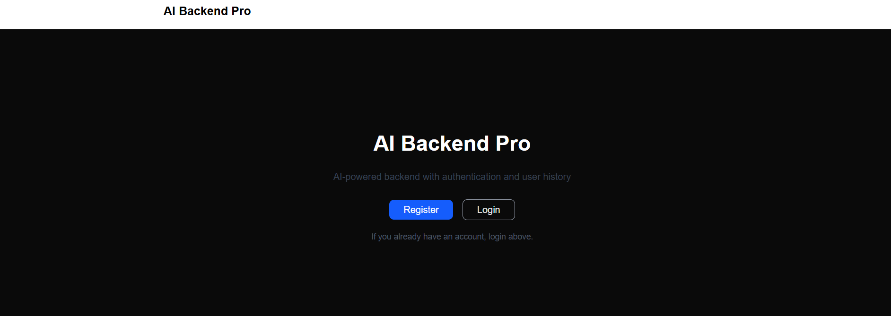
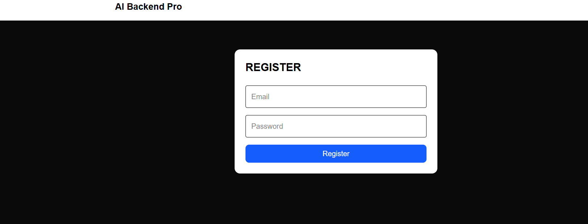
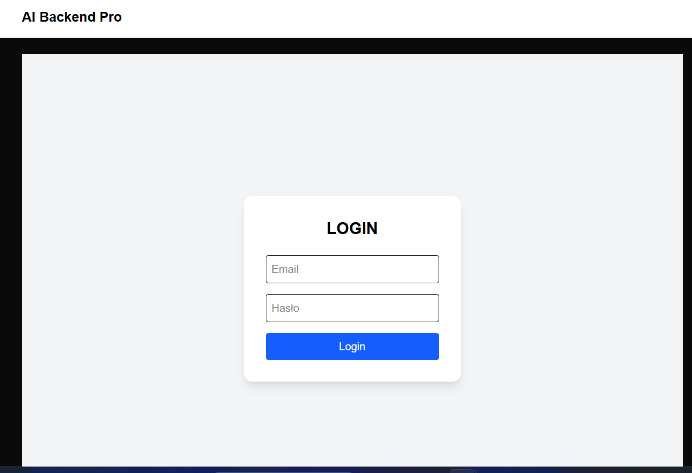
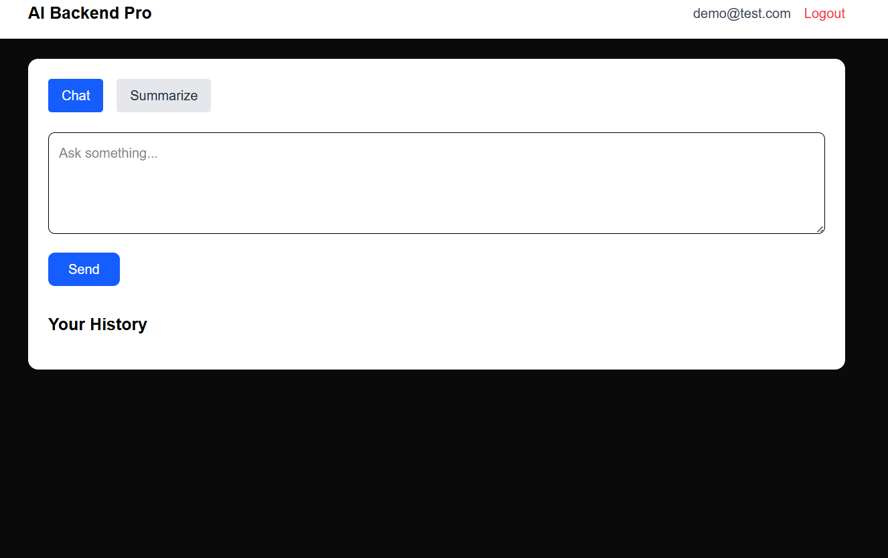
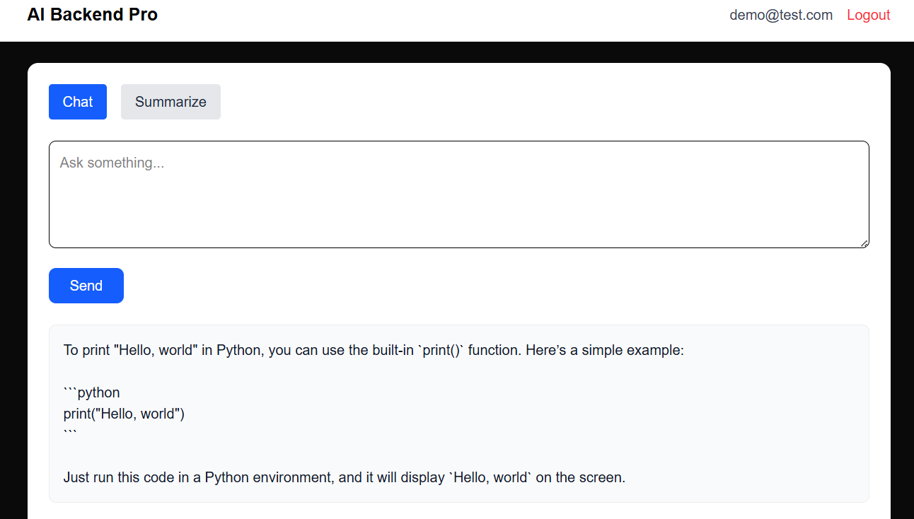
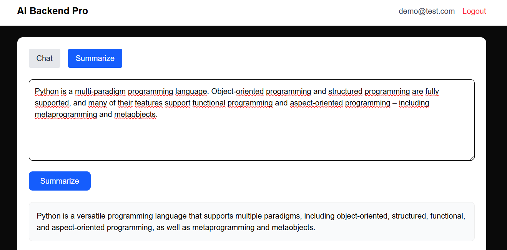
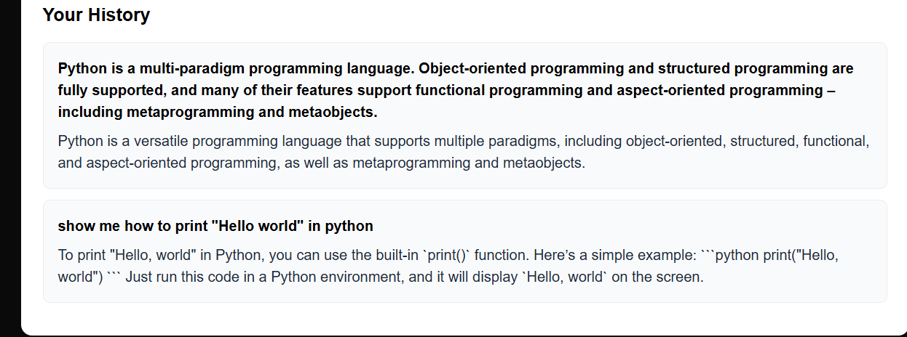

# AI Backend PRO

#Full-stack AI application with authentication, chat and text summarization.

# Links

Frontend: 
https://project1-1-mk3a.onrender.com

Backend API:
https://project1-g35v.onrender.com

Swagger UI:
https://project1-g35v.onrender.com/docs

Demo Account:
email: demo@test.com 
password: demo123

Important: App is hosted on Render free tier.
First request may take around 30-60 seconds due to cold start.

# Features
- User registration
- User authentication (JSON Web Token)
- AI chat powered by OPENAI
- Tet summarization
- Chat and summarization history per user
- Secure backend API
- Cloud deployment

# Tech Stack
Frontend:
- Next.js
- React
- TailwindCSS
- TypeScript

  Backend:
  - Python
  - Fast API
  - SQLAlchemy
  - JWT Authentication
 
Database:
- PostgreSQL

AI:
- OpenAI API

Infrastructure:
- Docker
- Render Cloud

#Architecture

User -> Next.js Frontend -> FastAPI Backend -> PostgreSQL -> OpenAI API
Deployment: Render Cloud

# Run locally:

git clone https://github.com/DavidWoszczyk/project1.git

Backend:
docker compose up --build

Frontend:
npm install
npm run dev

# Screeshots

